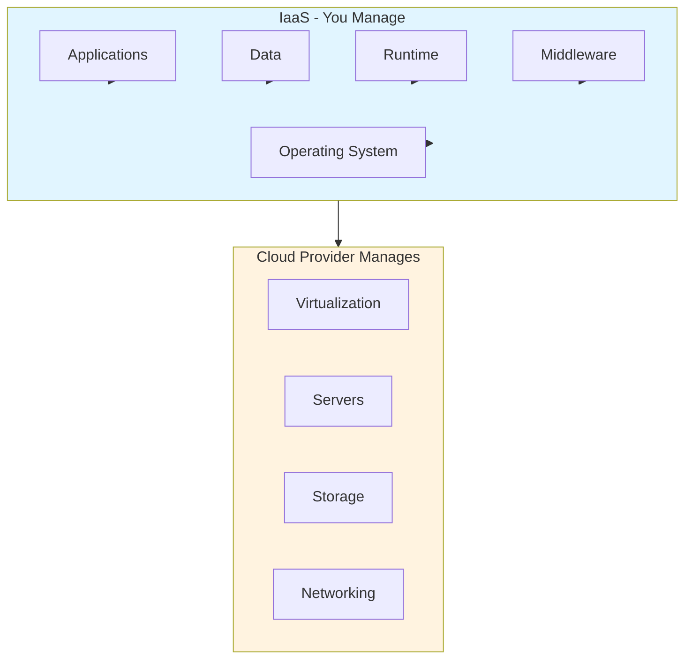
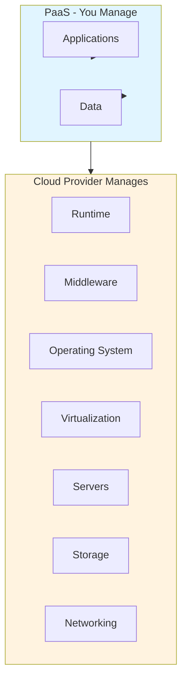
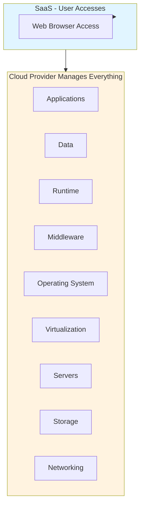
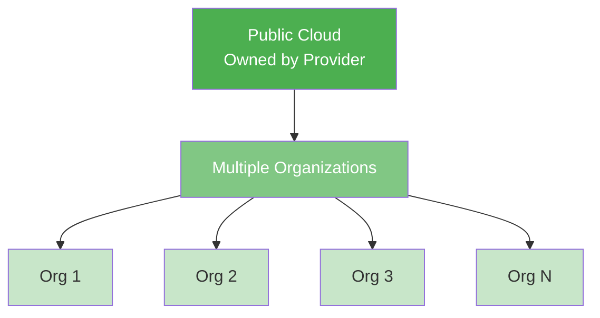
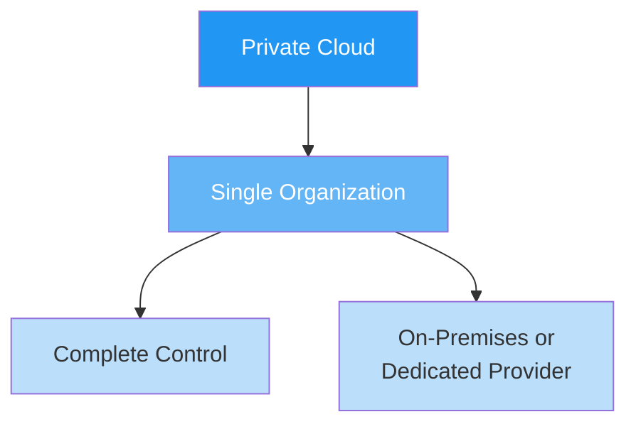
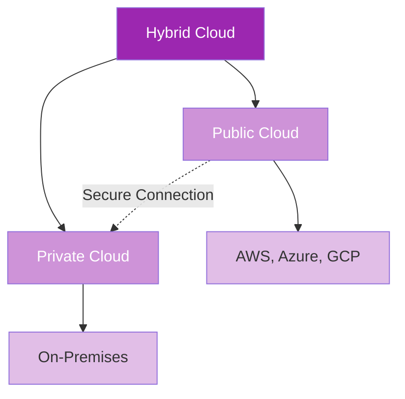
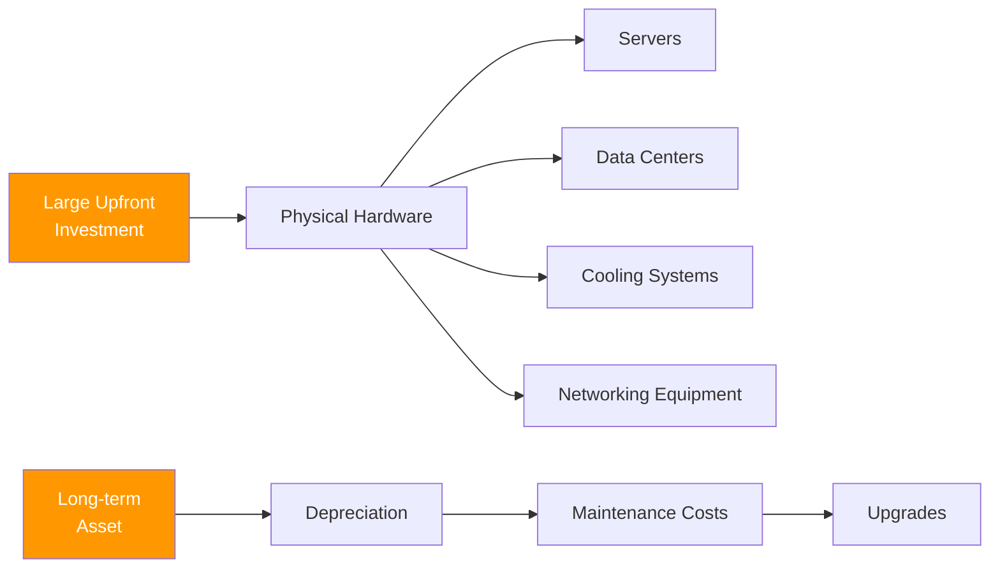
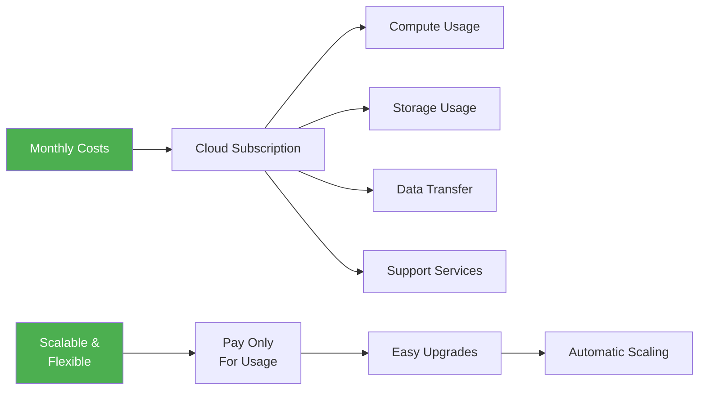
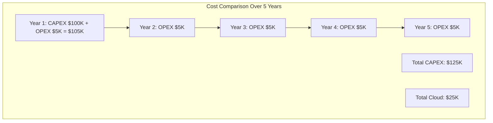
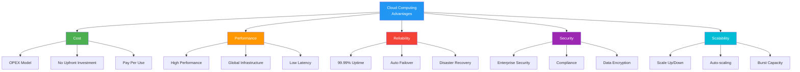

# ☁️ Cloud Concepts & Fundamentals

This section covers the foundational concepts of cloud computing, deployment models, and cost structures.

## 📚 Topics Covered

1. [What is Cloud Computing?](#what-is-cloud-computing)
2. [Service Models (IaaS, PaaS, SaaS)](#service-models)
3. [Deployment Models (Public, Private, Hybrid)](#deployment-models)
4. [CAPEX vs OPEX](#capex-vs-opex)
5. [Advantages of Cloud Computing](#advantages)

---

## What is Cloud Computing?

Cloud computing delivers computing services (compute, storage, networking, databases, software) over the internet from cloud providers' data centers.

### Key Characteristics

- **On-Demand Self-Service** - Access resources anytime
- **Broad Network Access** - Available over the internet
- **Resource Pooling** - Multi-tenant shared resources
- **Rapid Elasticity** - Scale up/down quickly
- **Measured Service** - Pay for what you use

---

## Service Models

### 1. Infrastructure as a Service (IaaS)

**Definition:** Cloud provider manages infrastructure; you manage OS, middleware, runtime, applications.

**Services:**
- Virtual Machines
- Storage Services
- Networking
- Load Balancers
- Firewalls

**Examples:**
- Azure Virtual Machines
- AWS EC2
- DigitalOcean

**When to Use:**
- Need maximum control & flexibility
- Legacy applications
- Custom configurations required
- High performance requirements

---

### 2. Platform as a Service (PaaS)

**Definition:** Cloud provider manages infrastructure & middleware; you manage applications & data.

**Services:**
- Application hosting
- Database services
- Development tools
- Business intelligence
- Middleware

**Examples:**
- Azure App Service
- Google App Engine
- Heroku

**When to Use:**
- Focus on development
- Rapid application development
- Multiple developers/teams
- Integrated development tools needed

---

### 3. Software as a Service (SaaS)

**Definition:** Cloud provider manages everything; users access via web browser.

**Examples:**
- Microsoft 365 / Office 365
- Google Workspace
- Salesforce
- Slack
- GitHub

**When to Use:**
- Need ready-to-use applications
- No infrastructure management desired
- Subscription-based pricing acceptable
- Multi-tenant scenarios

---

## Service Models Comparison

| Aspect | IaaS | PaaS | SaaS |
|--------|------|------|------|
| **Control** | High | Medium | Low |
| **Flexibility** | High | Medium | Low |
| **Complexity** | High | Medium | Low |
| **Cost** | Medium | Medium-Low | Low |
| **Maintenance** | Your responsibility | Shared | Provider |
| **Best For** | Custom apps, Legacy | Development | End users |
| **Scalability** | Manual/Auto | Auto | Built-in |

---

## Deployment Models

### 1. Public Cloud

**Definition:** Cloud infrastructure owned & operated by cloud provider; shared by multiple organizations.

**Characteristics:**
- No upfront infrastructure investment
- Shared resources
- Managed entirely by provider
- Pay-as-you-go pricing

**Benefits:**
- ✅ Cost Effective
- ✅ Highly Scalable
- ✅ Easy Maintenance
- ✅ Global Reach
- ✅ Quick Deployment

**Examples:**
- Azure
- AWS
- Google Cloud

**Use Cases:**
- Web applications
- Development & testing
- Startup projects
- Non-sensitive workloads

---

### 2. Private Cloud

**Definition:** Cloud infrastructure owned & managed by organization internally or by dedicated provider.

**Characteristics:**
- Dedicated infrastructure
- Single organization usage
- Complete control
- Higher security

**Benefits:**
- ✅ Better Control
- ✅ Higher Security
- ✅ Customization
- ✅ Data Sovereignty
- ✅ Compliance

**Use Cases:**
- Sensitive data processing
- Financial institutions
- Healthcare records
- Legal/Compliance requirements
- Performance-critical applications

---

### 3. Hybrid Cloud

**Definition:** Combination of public and private cloud connected together.

**Characteristics:**
- Combination of public + private
- Seamless data movement
- Flexible workload placement
- Integrated management

**Benefits:**
- ✅ Flexibility & Control
- ✅ Cost Optimization
- ✅ Data Compliance
- ✅ Disaster Recovery
- ✅ Scalability

**Use Cases:**
- Legacy system migration
- Burst capacity needs
- Data sovereignty requirements
- Gradual cloud adoption
- Business continuity

---

## CAPEX vs OPEX

### CAPEX (Capital Expenditure)

**Traditional IT Model**

**Components:**
- Servers & Hardware ($10,000 - $1,000,000+)
- Data Centers ($500,000+)
- Cooling & Power Systems ($100,000+)
- Networking Infrastructure ($50,000+)
- Implementation & Setup ($100,000+)

**Characteristics:**
- ❌ High initial cost
- ❌ Long ROI period
- ❌ Fixed infrastructure
- ❌ Maintenance responsibility
- ✅ Complete ownership
- ✅ Long-term cost savings

**Example:** Building a data center costs $2M upfront

---

### OPEX (Operational Expenditure)

**Cloud Model**

**Components:**
- Compute Services ($0.01 - $1+ per hour)
- Storage Services ($0.023 - $0.10 per GB/month)
- Data Transfer ($0 - $0.10 per GB)
- Premium Features & Support ($0 - $1000+/month)

**Characteristics:**
- ✅ Low initial cost
- ✅ Flexible scaling
- ✅ Predictable monthly costs
- ✅ Easy to adjust
- ❌ Ongoing costs
- ❌ No asset ownership

**Example:** VM costs $0.096/hour = ~$70/month

---

## CAPEX vs OPEX Comparison

| Factor | CAPEX (Traditional) | OPEX (Cloud) |
|--------|-------------------|--------------|
| **Initial Cost** | $50K - $1M+ | $0 - $1K |
| **Monthly Cost** | $5K - $50K | $1K - $10K |
| **Year 1 Total** | $110K - $1.06M | $12K - $120K |
| **5-Year Total** | $350K - $3M+ | $60K - $600K |
| **Scalability** | Difficult, Expensive | Easy, Included |
| **Maintenance** | Your Team | Provider |
| **Break-even** | 2-3 years | Ongoing benefit |

---

## Advantages of Cloud Computing

### 1. Scalability
- **Vertical:** Add more CPU/RAM to existing resources
- **Horizontal:** Add more resources to the system
- **Automatic:** Scale based on demand automatically

### 2. High Availability
- Multiple data centers & redundancy
- Failover mechanisms built-in
- 99.99% - 99.999% SLA guarantees

### 3. Elasticity
- Automatically add/remove resources
- Respond to demand spikes
- Reduce costs during low usage

### 4. Cost Optimization
- No CAPEX costs
- OPEX model matches revenue
- Usage-based billing
- Reserved instances for discounts

### 5. Global Reach
- Data centers worldwide
- Deploy applications globally
- Low latency for end-users
- Compliance with local regulations

### 6. Security
- Enterprise-grade security
- Compliance certifications (SOC 2, HIPAA, GDPR, etc.)
- Data encryption (in transit & at rest)
- Regular security audits

### 7. Disaster Recovery
- Built-in backup & replication
- Quick recovery time
- Geographic redundancy
- Business continuity guaranteed

### 8. Agility & Innovation
- Quick deployment
- Rapid iteration
- Access to latest technologies
- Focus on business logic

---

## Key Takeaways

✅ Cloud computing eliminates infrastructure management burden  
✅ Choose service model (IaaS/PaaS/SaaS) based on control needs  
✅ Select deployment model (Public/Private/Hybrid) based on requirements  
✅ OPEX model provides cost flexibility vs CAPEX upfront investment  
✅ Cloud provides scalability, reliability, and security at scale  

---

## Next Steps

- Read: [02-azure-deployment-models](../02-azure-deployment-models/README.md)
- Read: [03-azure-services-overview](../03-azure-services-overview/README.md)
