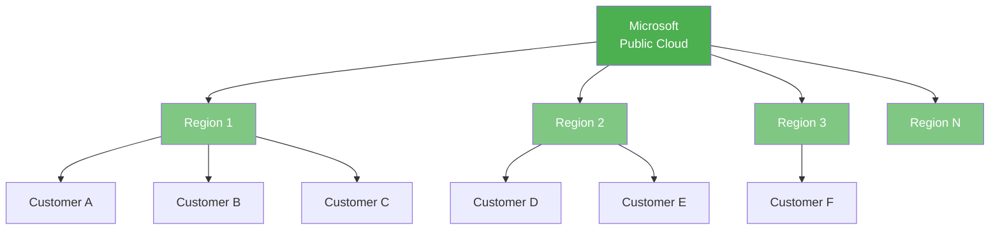
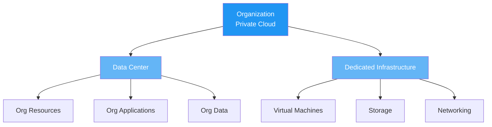
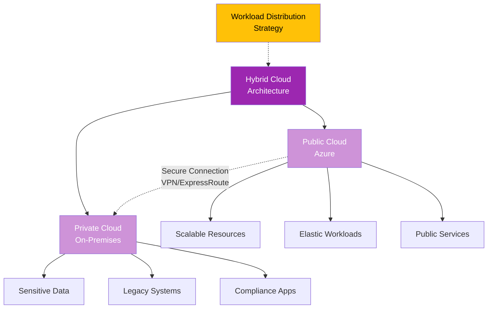
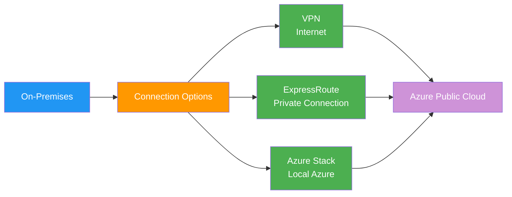
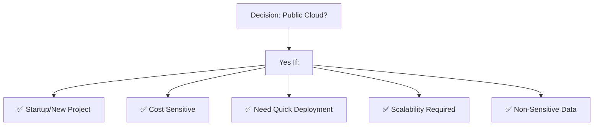
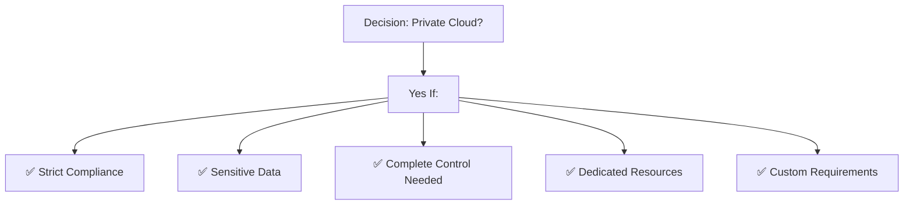
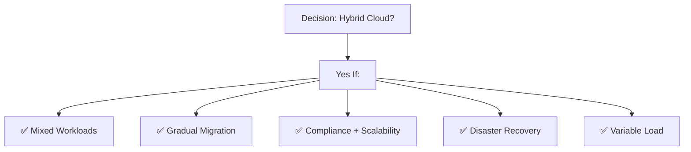

# 🌐 Azure Deployment Models

Comprehensive guide to Azure deployment models: Public Cloud, Private Cloud, and Hybrid Cloud.

## 📚 Table of Contents

1. [Public Cloud](#public-cloud)
2. [Private Cloud](#private-cloud)
3. [Hybrid Cloud](#hybrid-cloud)
4. [Comparison](#comparison)
5. [Decision Framework](#decision-framework)

---

## Public Cloud

### Overview

Azure Public Cloud is infrastructure owned and operated by Microsoft, available to the public on a subscription basis.

### Characteristics

| Aspect | Details |
|--------|---------|
| **Ownership** | Microsoft |
| **Management** | Microsoft |
| **Infrastructure** | Shared (Multi-tenant) |
| **Access** | Internet (Public) |
| **Cost Model** | Pay-as-you-go |
| **Data Centers** | 60+ regions worldwide |

### Benefits

✅ **Cost Effective**
- No upfront infrastructure investment
- Pay only for resources used
- Economies of scale

✅ **Highly Scalable**
- Instant capacity available
- Auto-scaling capabilities
- No hardware limits

✅ **Easy Maintenance**
- Microsoft manages infrastructure
- Automatic updates & patches
- No hardware responsibility

✅ **Global Reach**
- Deploy to 60+ regions
- Low latency worldwide
- Compliance with local regulations

✅ **Quick Deployment**
- Resources available in minutes
- Rapid application deployment
- Time-to-market reduced

### Use Cases

- Web applications
- Mobile applications
- Development & testing
- Data analytics
- IoT applications
- Startup projects
- Non-sensitive workloads

---

## Private Cloud

### Overview

Private Cloud is infrastructure owned and managed by the organization, either on-premises or with a dedicated provider.

### Characteristics

| Aspect | Details |
|--------|---------|
| **Ownership** | Organization |
| **Management** | Organization or dedicated provider |
| **Infrastructure** | Dedicated (Single-tenant) |
| **Access** | Internal network (Private) |
| **Cost Model** | Upfront CAPEX + ongoing OPEX |
| **Location** | On-premises or hosted |

### Benefits

✅ **Complete Control**
- Full customization capabilities
- Custom configurations
- Proprietary technologies

✅ **Higher Security**
- Dedicated infrastructure
- No resource sharing
- Complete data isolation
- Compliance control

✅ **Performance Guaranteed**
- No resource contention
- Dedicated resources
- Predictable performance

✅ **Data Sovereignty**
- Data stays within organization
- Regulatory compliance (GDPR, HIPAA)
- Local data residency

✅ **Privacy & Compliance**
- Restricted access
- Audit trails
- Compliance certifications

### Challenges

❌ High initial infrastructure cost  
❌ Ongoing maintenance responsibility  
❌ Limited scalability (physical limits)  
❌ Requires skilled IT team  
❌ Slower deployment  

### Use Cases

- Financial institutions
- Healthcare organizations
- Government agencies
- Legal firms
- Sensitive data processing
- Compliance-heavy industries
- Performance-critical applications

---

## Hybrid Cloud

### Overview

Hybrid Cloud combines public cloud and private cloud infrastructure, with seamless integration and data movement.

### Characteristics

| Aspect | Details |
|--------|---------|
| **Ownership** | Mixed (Org + Provider) |
| **Management** | Distributed management |
| **Infrastructure** | Public + Private |
| **Access** | Hybrid network connectivity |
| **Cost Model** | Mixed CAPEX + OPEX |
| **Integration** | Seamless & secure |

### Benefits

✅ **Flexibility**
- Choose best environment for each workload
- Legacy + Modern applications
- Gradual migration path

✅ **Cost Optimization**
- Public cloud for elastic workloads
- Private cloud for baseline capacity
- Reduced infrastructure investment

✅ **Data Compliance**
- Sensitive data on-premises
- Public data in cloud
- Meeting regulatory requirements

✅ **Disaster Recovery**
- On-premises backup
- Cloud recovery capabilities
- Business continuity

✅ **Scalability**
- Burst to public cloud
- Handle peak loads
- Cost-effective scaling

### Hybrid Cloud Connection Methods

### Use Cases

- **Gradual Cloud Migration**
  - Move applications incrementally
  - Minimize disruption
  - Test before full migration

- **Workload Optimization**
  - Legacy systems on-premises
  - New apps in cloud
  - Best of both worlds

- **Disaster Recovery**
  - Primary: On-premises
  - Secondary: Cloud backup

- **Data Residency**
  - Sensitive data on-premises
  - Processing in cloud

- **High Availability**
  - Redundancy across both
  - Automatic failover

---

## Comparison

### Feature Comparison

| Feature | Public Cloud | Private Cloud | Hybrid Cloud |
|---------|--------------|---------------|--------------|
| **Cost** | Low | High | Medium |
| **Control** | Low | High | Medium |
| **Security** | High (Shared) | Very High | Very High |
| **Scalability** | Unlimited | Limited | Good |
| **Flexibility** | High | Medium | Very High |
| **Compliance** | Many options | Custom | Customized |
| **Performance** | Variable | Guaranteed | Mixed |
| **Setup Time** | Minutes | Months | Weeks |
| **Maintenance** | Provider | Organization | Both |

---

## Decision Framework

### Choose Public Cloud If:

### Choose Private Cloud If:

### Choose Hybrid Cloud If:

---

## Azure Services for Each Model

### Public Cloud Services
- Virtual Machines
- App Service
- SQL Database
- Azure Kubernetes Service
- Cosmos DB
- Storage Accounts

### Private Cloud Solutions
- Azure Stack Hub (on-premises Azure)
- Azure Stack Edge (edge computing)
- Private link connectivity
- Managed services

### Hybrid Cloud Connection
- Azure Hybrid Benefits
- Azure ExpressRoute
- Site-to-Site VPN
- Azure Arc (manage resources anywhere)
- Azure Stack HCI

---

## Key Takeaways

✅ Public Cloud offers cost-effectiveness and scalability  
✅ Private Cloud provides control and security  
✅ Hybrid Cloud combines benefits of both  
✅ Choose based on compliance, cost, and workload requirements  
✅ Most enterprises use hybrid model for flexibility  

---

## Next Steps

- Read: [03-azure-services-overview](../03-azure-services-overview/README.md)
- Read: [04-compute-services](../04-compute-services/README.md)
