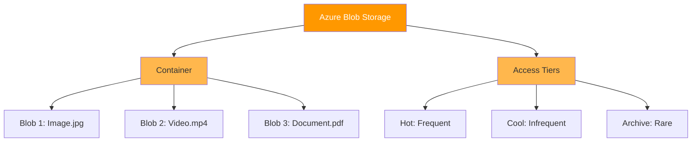
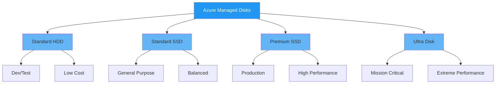
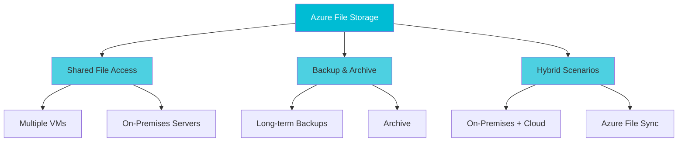
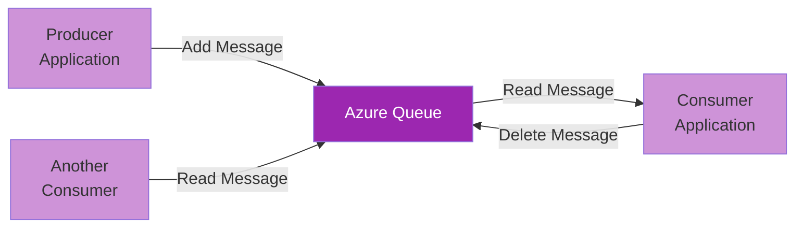
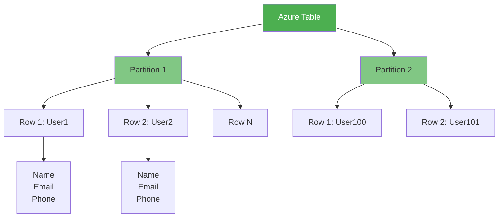
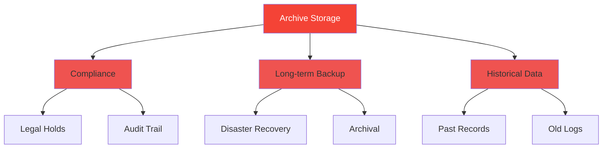
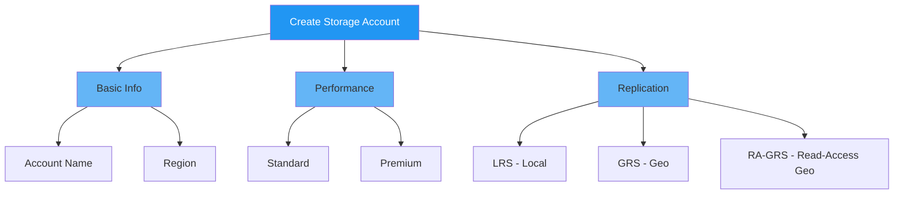
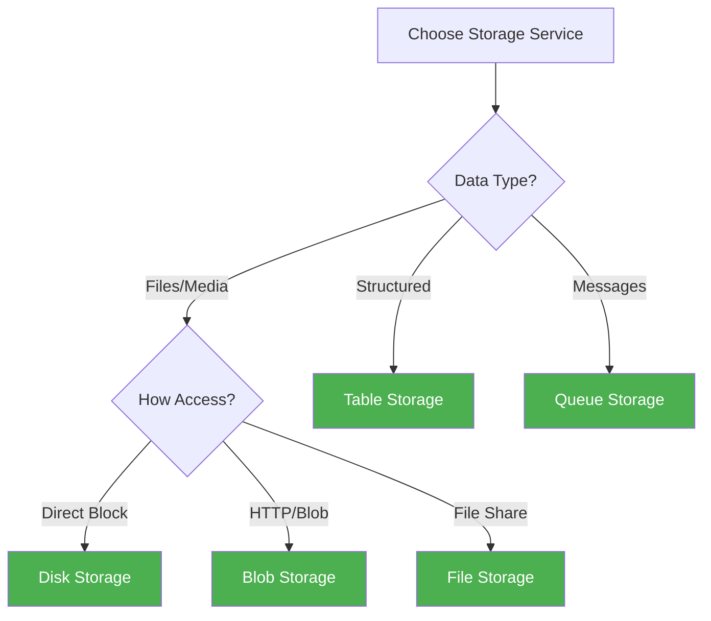

# 💾 Storage Services

Comprehensive guide to Azure storage services for different data types and access patterns.

## 📚 Services Covered

1. [Azure Blob Storage](#azure-blob-storage)
2. [Azure Disk Storage](#azure-disk-storage)
3. [Azure File Storage](#azure-file-storage)
4. [Azure Queue Storage](#azure-queue-storage)
5. [Azure Table Storage](#azure-table-storage)
6. [Azure Archive Storage](#azure-archive-storage)
7. [Storage Account Basics](#storage-account-basics)
8. [Comparison & Selection](#comparison--selection)

---

## Azure Blob Storage

### What is Blob Storage?

Object storage for unstructured data (any file type, any size).

### Key Features



### Storage Tiers

| Tier | Access Cost | Storage Cost | Use Case | Min Duration |
|------|-----------|--------------|----------|--------------|
| **Hot** | Low | High | Frequent access | None |
| **Cool** | High | Low | Infrequent (30+ days) | 30 days |
| **Archive** | Very High | Very Low | Rare (90+ days) | 90 days |

### Use Cases

- Images & Videos
- Backup & Archive
- Log Files
- Media Distribution
- Data for Analysis

### Common Operations

```powershell
# Create Storage Account
az storage account create --name mystorageacct --resource-group myResourceGroup

# Create Container
az storage container create --account-name mystorageacct --name mycontainer

# Upload Blob
az storage blob upload --account-name mystorageacct --container-name mycontainer \
  --name myfile.txt --file local_file.txt

# Download Blob
az storage blob download --account-name mystorageacct --container-name mycontainer \
  --name myfile.txt --file local_file.txt
```

---

## Azure Disk Storage

### What is Disk Storage?

Persistent block storage for Virtual Machines.

### Disk Types



| Type | IOPS | Throughput | Cost | Use Case |
|------|------|-----------|------|----------|
| **Standard HDD** | 500 | 60 MB/s | Low | Dev/Test |
| **Standard SSD** | 6,000 | 750 MB/s | Medium | General Purpose |
| **Premium SSD** | 20,000 | 900 MB/s | High | Production |
| **Ultra** | 160,000 | 2,000 MB/s | Very High | Mission Critical |

### Use Cases

- Operating System Disks
- Application Data
- Database Storage
- Virtual Machine Storage

### PowerShell Example

```powershell
# Create managed disk
New-AzDisk -ResourceGroupName myResourceGroup -DiskName myDisk `
  -Disk (New-AzDiskConfig -Location eastus -CreateOption Empty -DiskSizeGB 128 `
  -SkuName Premium_LRS)

# Attach to VM
$vm = Get-AzVM -ResourceGroupName myResourceGroup -Name myVM
$disk = Get-AzDisk -ResourceGroupName myResourceGroup -DiskName myDisk
$vm = Add-AzVMDataDisk -VM $vm -Name "myDisk" -ManagedDiskId $disk.Id -Lun 0
Update-AzVM -ResourceGroupName myResourceGroup -VM $vm
```

---

## Azure File Storage

### What is File Storage?

Managed cloud file shares accessible via SMB protocol.

### Key Features

- SMB 3.0 protocol
- POSIX file system compliance
- Azure File Sync for hybrid scenarios
- Identity-based authentication

### Use Cases



### PowerShell Example

```powershell
# Create file share
New-AzStorageShare -Name myshare -Context $storageContext

# Mount on Windows
$storageAccountKey = (Get-AzStorageAccountKey -ResourceGroupName myResourceGroup `
  -Name mystorageacct)[0].Value
$password = ConvertTo-SecureString -String $storageAccountKey -AsPlainText -Force
$credential = New-Object System.Management.Automation.PSCredential `
  -ArgumentList "Azure\mystorageacct", $password
New-PSDrive -Name Z -PSProvider FileSystem -Root "\\mystorageacct.file.core.windows.net\myshare" `
  -Credential $credential -Persist
```

---

## Azure Queue Storage

### What is Queue Storage?

Asynchronous messaging service for decoupling applications.

### Architecture



### Use Cases

- Decouple application components
- Process large batches
- Scheduled job processing
- Buffering request spikes
- Event-driven architectures

### Python Example

```python
from azure.storage.queue import QueueClient

# Connect to queue
queue_client = QueueClient.from_connection_string(conn_str, "myqueue")

# Send message
queue_client.send_message("Hello World!")

# Receive message
messages = queue_client.receive_messages()
for msg in messages:
    print(msg.content)
    queue_client.delete_message(msg)
```

---

## Azure Table Storage

### What is Table Storage?

NoSQL key-value store for semi-structured data.

### Key Concepts

- **Partition Key** - Groups related data
- **Row Key** - Unique identifier within partition
- **Timestamp** - Automatic timestamp
- **Properties** - Custom attributes

### Architecture



### Use Cases

- User profiles
- Device logs
- Session management
- Metadata storage
- IoT device data

### C# Example

```csharp
using Azure.Data.Tables;

// Create table client
var tableClient = new TableClient(new Uri("https://mystorageacct.table.core.windows.net/"),
    "myTable", new TableSharedKeyCredential("mystorageacct", storageKey));

// Create entity
var entity = new TableEntity("Users", "user1")
{
    { "FirstName", "John" },
    { "LastName", "Doe" },
    { "Email", "john@example.com" }
};

// Add entity
await tableClient.AddEntityAsync(entity);

// Query
var query = tableClient.QueryAsync<TableEntity>(e => e.PartitionKey == "Users");
```

---

## Azure Archive Storage

### What is Archive Storage?

Ultra-low-cost storage for rarely accessed data.

### Characteristics

- Lowest cost per GB
- High access latency (15 min - 1 hour)
- Long-term retention (7+ years)
- Data must remain at least 90 days

### Use Cases



---

## Storage Account Basics

### What is a Storage Account?

Unique namespace in Azure for storing and accessing data.

### Storage Account Setup



### Replication Options

| Option | Replicas | Availability | Cost |
|--------|----------|--------------|------|
| **LRS** | 3 (same DC) | 99.99% | Low |
| **ZRS** | 3 (multiple AZs) | 99.99% | Medium |
| **GRS** | 3 + 3 (paired region) | 99.99% | High |
| **RA-GRS** | 3 + 3 (read access) | 99.99% | Highest |

### PowerShell Setup

```powershell
# Create resource group
New-AzResourceGroup -Name myResourceGroup -Location eastus

# Create storage account
$storageAccount = New-AzStorageAccount -Name mystorageacct `
  -ResourceGroupName myResourceGroup -Location eastus `
  -SkuName Standard_GRS -Kind StorageV2

# Get storage context
$storageContext = $storageAccount.Context
```

---

## Comparison & Selection

### Service Comparison

| Feature | Blob | Disk | File | Queue | Table |
|---------|------|------|------|-------|-------|
| **Data Type** | Unstructured | Block | File Shares | Messages | Semi-structured |
| **Protocol** | HTTPS | Block | SMB | HTTPS | HTTPS |
| **Access** | HTTP | VM Direct | Network | API | API |
| **Scalability** | ✅ ✅ ✅ | ✅ ✅ | ✅ | ✅ ✅ | ✅ ✅ |
| **Cost** | Low | Medium | Medium | Low | Very Low |
| **Latency** | Low | Very Low | Low-Medium | Low | Low |

### Decision Tree



---

## Key Takeaways

✅ Use Blob Storage for unstructured data (images, videos, logs)  
✅ Use Disk Storage for VM persistent storage  
✅ Use File Storage for shared file access (SMB)  
✅ Use Queue Storage for async messaging  
✅ Use Table Storage for key-value data  
✅ Use Archive for long-term retention  

---

## Next Steps

- Read: [06-database-services](../06-database-services/README.md)
- See: [practical-experiments](../08-practical-experiments/README.md)
