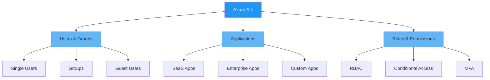
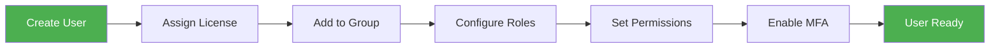
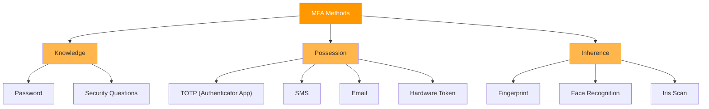
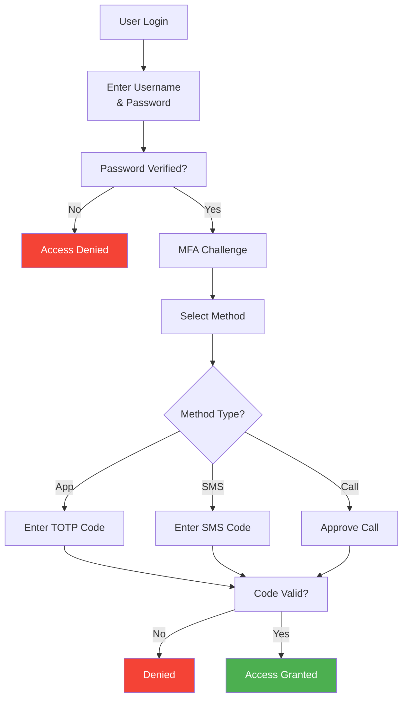
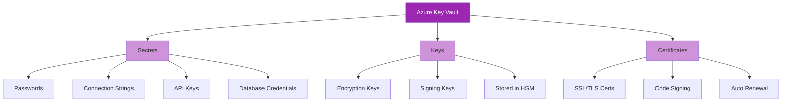
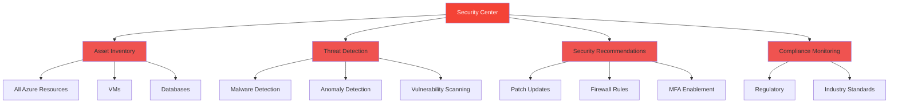
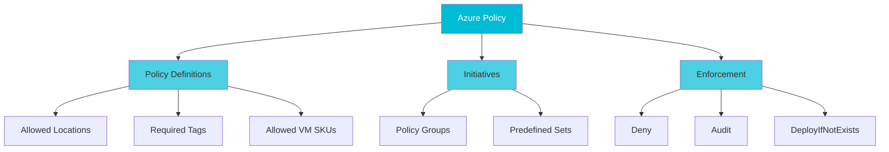
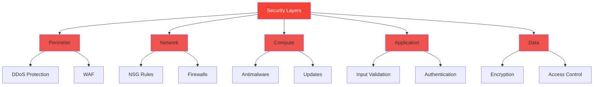

# 🔐 Security, Compliance & Identity Management

Comprehensive guide to Azure security services and best practices.

## 📚 Topics Covered

1. [Azure Active Directory](#azure-active-directory)
2. [Multi-Factor Authentication](#multi-factor-authentication)
3. [Azure Key Vault](#azure-key-vault)
4. [Azure Security Services](#azure-security-services)
5. [Compliance & Governance](#compliance--governance)
6. [Security Best Practices](#security-best-practices)

---

## Azure Active Directory

### What is Azure AD?

Cloud identity and access management service for managing users, groups, and application access.

### Core Concepts



### Key Features

✅ **Single Sign-On (SSO)** - One login for multiple apps  
✅ **User Authentication** - Secure identity verification  
✅ **Identity Protection** - Detect & remediate risks  
✅ **Conditional Access** - Policy-based access control  
✅ **Guest Access** - External user collaboration  
✅ **Hybrid Support** - On-premises + cloud integration  

### User Management Workflow



### Azure AD Editions

| Edition | Users | Features | Cost |
|---------|-------|----------|------|
| **Free** | Unlimited | Basic | Free |
| **Office 365** | Unlimited | Self-Service | Included |
| **Premium P1** | Unlimited | Advanced | $6/user/month |
| **Premium P2** | Unlimited | All Features | $9/user/month |

### PowerShell: Create User

```powershell
# Connect to Azure AD
Connect-AzureAD

# Create new user
$PasswordProfile = New-Object -TypeName Microsoft.Open.AzureAD.Model.PasswordProfile
$PasswordProfile.Password = "TempPassword123!"
$PasswordProfile.ForceChangePasswordNextLogin = $true

New-AzureADUser -AccountEnabled $true `
  -DisplayName "John Doe" `
  -UserPrincipalName "john.doe@contoso.onmicrosoft.com" `
  -PasswordProfile $PasswordProfile `
  -MailNickname "john.doe"

# Get all users
Get-AzureADUser -All $true | Select ObjectId, DisplayName, UserPrincipalName
```

---

## Multi-Factor Authentication

### What is MFA?

Authentication requiring multiple verification methods (something you know, have, are).

### MFA Methods



### MFA Authentication Flow



### Enabling MFA

```powershell
# Require MFA for specific user
$mfaRequirement = New-Object -TypeName Microsoft.Open.AzureAD.Model.StrongAuthenticationRequirement
$mfaRequirement.RelyingParty = "*"
$mfaRequirement.State = "Enabled"

$requirements = @($mfaRequirement)
Set-AzureADUser -ObjectId "user@contoso.com" `
  -StrongAuthenticationRequirements $requirements
```

### Benefits

✅ **Enhanced Security** - Prevents unauthorized access  
✅ **Compliance** - Meets regulatory requirements  
✅ **Risk Reduction** - Mitigates password attacks  
✅ **User Control** - Multiple authentication options  

---

## Azure Key Vault

### What is Key Vault?

Centralized cloud service for managing secrets, keys, and certificates.

### Key Vault Components



### Access Control

- **Role-Based Access Control (RBAC)**
- **Access Policies** - Per-object permissions
- **Network Rules** - Firewall restrictions
- **Audit Logging** - All access tracked

### PowerShell: Create & Manage Secrets

```powershell
# Create Key Vault
New-AzKeyVault -Name myKeyVault -ResourceGroupName myResourceGroup `
  -Location eastus -EnabledForSecretStorage

# Create secret
$SecretValue = ConvertTo-SecureString 'MySecret123!' -AsPlainText -Force
Set-AzKeyVaultSecret -VaultName myKeyVault -Name dbPassword `
  -SecretValue $SecretValue

# Retrieve secret
$secret = Get-AzKeyVaultSecret -VaultName myKeyVault -Name dbPassword
$secretValue = $secret.SecretValue | ConvertFrom-SecureString -AsPlainText

# List all secrets
Get-AzKeyVaultSecret -VaultName myKeyVault

# Delete secret
Remove-AzKeyVaultSecret -VaultName myKeyVault -Name dbPassword -Force
```

### Benefits

✅ **Centralized Management** - Single source of truth  
✅ **Security** - HSM-backed storage  
✅ **Audit Trail** - All access logged  
✅ **Integration** - Works with Azure services  
✅ **Automatic Rotation** - Optional secret rotation  

---

## Azure Security Services

### Security Center

Unified security management and threat intelligence.



### Azure Defender

Advanced threat protection for resources.

**Protections:**
- VMs & servers
- SQL databases
- App Service
- Storage accounts
- Kubernetes clusters
- Key Vault

### DDoS Protection

Protection against distributed denial-of-service attacks.

**Standard DDoS Protection:**
- Automatic attack mitigation
- Real-time attack metrics
- Attack analytics & insights

---

## Compliance & Governance

### Azure Policy

Enforce organizational standards and compliance.



### Compliance Standards

| Standard | Focus | Use Case |
|----------|-------|----------|
| **SOC 2** | Security | Cloud services |
| **HIPAA** | Healthcare | Medical data |
| **GDPR** | Data Privacy | EU users |
| **PCI DSS** | Payment Security | Card payments |
| **ISO 27001** | Information Security | All organizations |
| **FedRAMP** | Government | Gov agencies |

### Governance Best Practices

1. **Resource Groups** - Logical organization
2. **Tagging Strategy** - Cost tracking & organization
3. **RBAC** - Least privilege access
4. **Azure Policy** - Enforce standards
5. **Audit Logs** - Monitor all changes
6. **Cost Management** - Track spending

---

## Security Best Practices

### Defense in Depth



### Top 10 Security Practices

✅ **Enable MFA** - Always require MFA for admin accounts  
✅ **Use Key Vault** - Never hardcode secrets  
✅ **Encrypt Data** - Enable encryption at rest & in transit  
✅ **Network Isolation** - Use NSGs and firewalls  
✅ **Least Privilege** - Grant minimum required access  
✅ **Regular Audits** - Review logs and permissions  
✅ **Keep Updated** - Patch all systems regularly  
✅ **Monitor Threats** - Use Security Center  
✅ **Plan Backup** - Implement disaster recovery  
✅ **Security Training** - Educate team members  

### Security Configuration Checklist

- [ ] MFA enabled for admin users
- [ ] Key Vault configured for secrets
- [ ] Encryption enabled (at rest & in transit)
- [ ] NSG rules configured (least privilege)
- [ ] Azure Policy enforced
- [ ] Auditing enabled
- [ ] RBAC properly configured
- [ ] Backups scheduled
- [ ] DDoS protection enabled
- [ ] Security alerts configured

---

## Key Takeaways

✅ Azure AD provides centralized identity management  
✅ MFA significantly enhances security  
✅ Key Vault secures sensitive data  
✅ Security Center monitors threats  
✅ Compliance frameworks ensure standards  
✅ Defense in depth protects all layers  

---

## Next Steps

- Read: [practical-experiments](../08-practical-experiments/README.md)
- Explore: [IoT Services](../11-iot-services/README.md)
